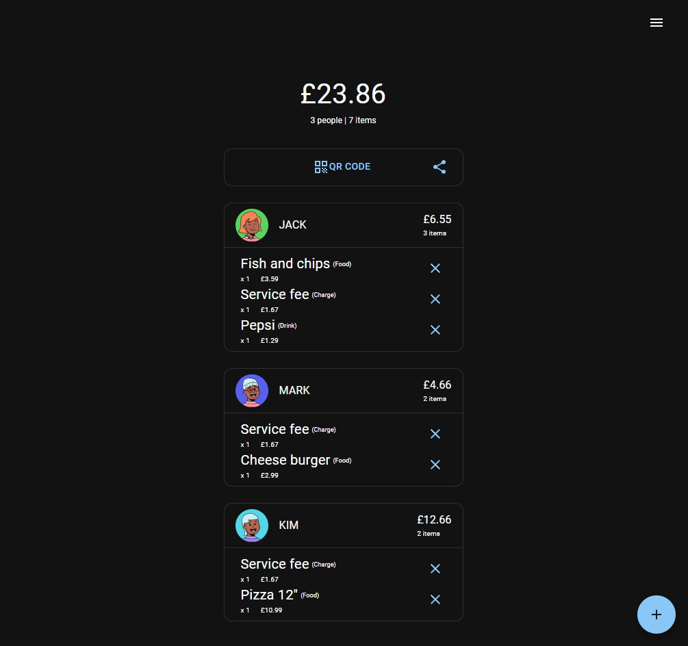

# split-bill

Website to keep track of everyone's orders to make splitting the bill easier.

<!-- TABLE OF CONTENTS -->
<details>
  <summary>Table of Contents</summary>
  <ol>
    <li>
      <a href="#about">About</a>
    </li>
    <li><a href="#built-with">Built With</a></li>
    <li><a href="#status">Status</a></li>
    <li><a href="#usage">Usage</a></li>
    <li>
      <a href="#getting-started">Getting Started</a>
      <ul>
        <li><a href="#for-development-locally">For development locally</a></li>
        <li><a href="#build-and-deploy">Build and deploy</a></li>
      </ul>
    </li>
  </ol>
</details>

## About

The bill arrives after a great meal, and now you have to tackle the tedious task of figuring out how much everyone pays to cover the bill.

It's not a simple task, especially when service charges, discounts, and more are added to the bill.

It helps to ensure everyone chips in fair and square, and it means you can leave the restaurant early and without a headache.



## Built with

-   React
-   Firebase
-   MUI
-   [react-nice-avatar](https://github.com/dapi-labs/react-nice-avatar)

## Status

This project is currently in development.

Most of the functionality works, but bugs and inconsistencies are present. There are also some features I would still like to add.

Unfortunately, updates to this project might be slow because I am currently prioritising new projects, and this one is quite old.

## Usage

You can fork the repository to change things, or you can clone this one and deploy it yourself.

## Getting started

-   You can run it locally, build and deploy it, or add it to your own repo for CI/CD.
-   You will need Node.JS installed, and you will need a Firebase account.
-   In the file firebase.js, you add your own firebase config.

### For development locally

-   Run it locally.
    ```
    npm run dev
    ```
    -   This will use vite, visit [localhost:5173](http://localhost:5173/) to see the site.
        -   Note: Check the console to get the link, as it might use another port.

### Build and deploy

-   Build the application.
    ```
    npm run build
    ```
-   You can then upload the files to a site like Netlify.
